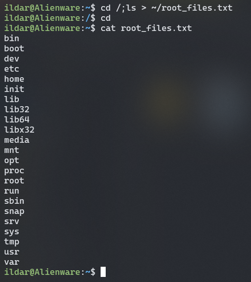
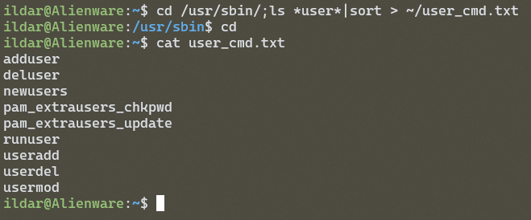
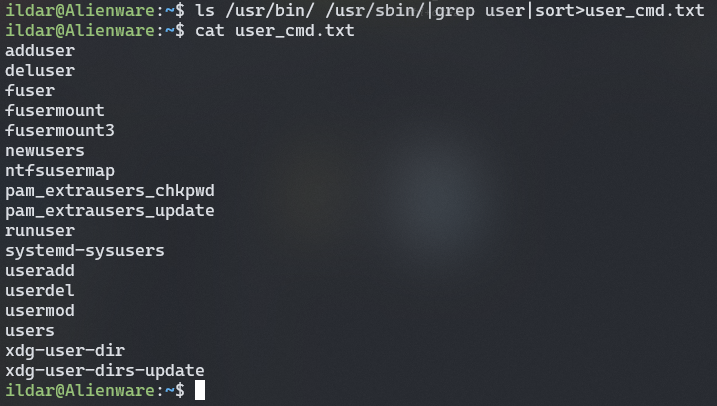
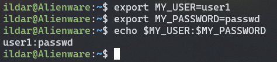
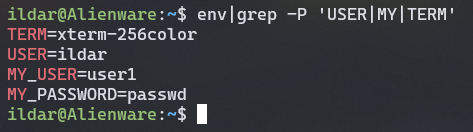
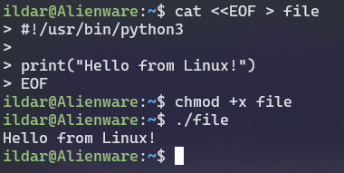
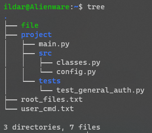

# Задание 1
``` bash
cd /;ls > ~/root_files.txt
```



# Задание 2

``` bash
cd /usr/sbin/;ls *user*|sort > ~/user_cmd.txt
```

``` bash
ls /usr/bin/ /usr/sbin/|grep user|sort>user_cmd.txt
```


# Задание 3

``` bash
export MY_USER=user1
export MY_PASSWORD=passwd

echo $MY_USER:$MY_PASSWORD
```


``` bash
env|grep -P 'USER|MY|TERM'
```

# Задание 4

``` bash
cat <<EOF > file
#!/usr/bin/python3
print("Hello from Linux!")
EOF

chmod +x file
./file
```



``` bash
sudo apt install tree
tree
```

